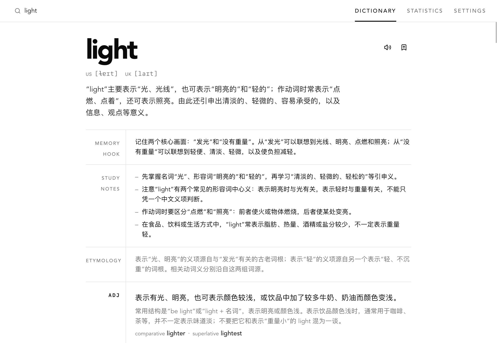

# LookUP简单的查词/翻译软件
对留学生来说非常有用的小工具。在上课遇到不会的单词的时候，直接按快捷键出来搜一搜，立马掌握。

## 核心功能
1. 基础的字典/查词界面由 Aictionary 开源项目改进而来。提供完善，简明易懂的翻译结果
2. 快捷键 popup 窗口快速查单词/翻译句子，不等待不尴尬


# 词典基座软件 Aictionary 介绍

<p>
  <a href="https://github.com/ahpxex/Aictionary/releases/latest"></a>
  <a href="https://github.com/ahpxex/Aictionary/releases"></a>
  <a href="./LICENSE"></a>
  
</p>



查一个词，本地词库直接秒出结果——八万多条学习者向的中文释义，讲用法、语境和常见搭配，而不是只丢给你一个「意思」。词库是一个本地 SQLite 文件，下载一次之后查询全在本机，断网也照常用。

词库里没有的词（生僻词、术语、新造的梗），配好一个 OpenAI 兼容接口就能让大模型现场写一条，存进你的个人词库，重新下载词库也不会丢。

还有一些顺手的东西：

- 单词朗读默认走免费免密钥的 Edge TTS，装好就能听；想要更好的音色可以换 Fish Audio、OpenAI 或 ElevenLabs
- 单词卡片能一键推到桌面版 Anki（走 AnkiConnect），生成排版统一的双语卡片
- 查词历史和频次都有统计，高频生词就是现成的复习清单
- 全局快捷键唤起、直接查剪贴板内容，读英文资料时基本不用碰鼠标
- macOS / Windows / Linux / Android 都有包

## 下载与安装

前往 [**Releases 页面**](https://github.com/ahpxex/Aictionary/releases/latest)下载对应平台的安装包，命名规则为 `Aictionary-[版本]_[平台]_[架构].[后缀]`。

| 平台 | 安装包 | 说明 |
| :--- | :--- | :--- |
| **macOS** | `.dmg` | 打开后将 Aictionary 拖入 Applications |
| **Windows** | `.msi` / 便携版 `.zip` | 双击安装，或解压便携版直接运行 |
| **Linux** | `.AppImage` | `chmod +x` 赋予可执行权限后直接运行 |
| **Android** | `.apk` | 通用包，允许安装未知来源应用后直接安装 |

> [!IMPORTANT]
> **macOS 若提示「应用已损坏」**：应用未经 Apple 公证，请在终端运行
> `xattr -cr /Applications/Aictionary.app` 后重新打开；或在「系统设置 → 隐私与安全性」中允许运行。

装好之后只有一步是必须的：打开「设置 → 词典」下载本地词库（自动从 GitHub Release 拉取、校验并解压）。LLM 接口配不配随意，不配也是一部完整的离线词典。

## 单词朗读（TTS）

在「设置 → 音频」中选择提供商：

| 提供商 | 密钥 | 说明 |
| :--- | :--- | :--- |
| **Edge TTS**（默认） | 无需 | 微软 Edge 朗读服务，免费、零配置，可选多种音色 |
| **Fish Audio** | 需要 | 支持 S1 等模型，可填 Reference ID 使用自定义克隆音色 |
| **OpenAI** | 需要 | OpenAI TTS 接口 |
| **ElevenLabs** | 需要 | ElevenLabs 语音合成 |

生成的音频会缓存到本地（如 macOS 的 `~/Library/Application Support/com.ahpx.aictionary-re/audio/`），同一单词只合成一次。所有 API Key 只保存在设备本地，不会上传。

> **网络提示**：部分网络环境会重置 Edge TTS 的 websocket 连接。「设置 → 音频」中可配置代理——桌面端默认自动读取环境变量和系统代理设置，Android 上需要手动填写。

## 与 Anki 同步卡片

依赖社区常用的 [AnkiConnect](https://foosoft.net/projects/anki-connect/) 插件：

1. 在 Anki 中安装并启用 AnkiConnect，保持 Anki 客户端开启；
2. 在「设置 → Anki」填写 API 地址（默认 `http://127.0.0.1:8765`）、牌组名称（不存在会自动创建）和卡片主题；
3. 在单词卡片上点击 **保存到 Anki**（书签图标）即可。

每张卡片包含单词、音标、释义、词形、详解例句和词义比较，并自动附加 `aictionary` 标签。

## 词库来源与许可

词条数据来自上游项目 **[ahpxex/open-dictionary](https://github.com/ahpxex/open-dictionary)** —— 一部以 Wiktionary/Wiktextract 快照为基础、再用大模型补写学习者向解释的开源英汉词典，当前收录 **84,212 个词条**。

Aictionary 只是它的一个消费者：从 GitHub Release 下载 `distribution.sqlite.gz` 到本地，经 SHA-256 校验后解压使用。词库的构建管线、选词规则和释义质量由上游负责，相关问题请到上游仓库反馈。

| | 许可 |
| :--- | :--- |
| 上游词典**数据** | [CC BY-SA 4.0](https://creativecommons.org/licenses/by-sa/4.0/)，Wiktionary 内容的衍生作品 |
| 上游与本项目**代码** | MIT |

数据依 ShareAlike 条款分发：再分发或二次加工时须以相同许可发布，并署名 Wiktionary 贡献者。

## 开发构建

前端是 React 19 + Vite + Tailwind v4 + shadcn/ui，桌面端和后端是 Tauri 2（Rust）。

需要 [Tauri 2 的环境依赖](https://tauri.app/start/prerequisites/)：Node.js / Bun、Rust stable；Linux 另需 webkit2gtk 等系统库。

```bash
bun install        # 安装依赖
bun tauri dev      # 桌面开发模式
bun tauri build    # 构建当前平台安装包，产物在 src-tauri/target/release/bundle/
```

Android 构建需要 Android SDK / NDK 和 JDK 21：

```bash
bun tauri android build --apk
```

GitHub Actions 会在打 tag 时对全平台（含 Android 签名 APK）执行构建并上传到 Release。

## 反馈与贡献

- 欢迎通过 [Issues](https://github.com/ahpxex/Aictionary/issues) 反馈 Bug 或功能建议；
- PR 请尽量附上改动说明或截图，用户可见文案记得同步更新中/英翻译（`src/shared/locales/`）；
- 扩展词库来源、支持更多平台、接入新的 LLM/TTS 提供商等方向都欢迎讨论。

## 致谢

- **[open-dictionary](https://github.com/ahpxex/open-dictionary)** 与其上游 **[Wiktionary](https://www.wiktionary.org/)** 的贡献者们——没有他们的持续编纂就没有这部词典的底子；
- **[linux.do](https://linux.do/)** 社区——大量真实使用反馈和功能建议来自那里的讨论；
- **每一位提过 [issue](https://github.com/ahpxex/Aictionary/issues) 和 [PR](https://github.com/ahpxex/Aictionary/pulls) 的人**——Linux 支持、打包修复、安装文档，以及认真描述清楚一个 bug 的每条反馈；
- 以及 [Tauri](https://tauri.app/)、[shadcn/ui](https://ui.shadcn.com/)、[Vercel AI SDK](https://ai-sdk.dev/) 等项目——应用的骨架建立在它们之上。

## License

本项目代码为 MIT，见 [`LICENSE`](./LICENSE)。内置词库并非本项目作品，以 **CC BY-SA 4.0** 发布（详见上文「词库来源与许可」）。

---

感谢使用 Aictionary，愿它能让你的查词过程更轻松一点点。
